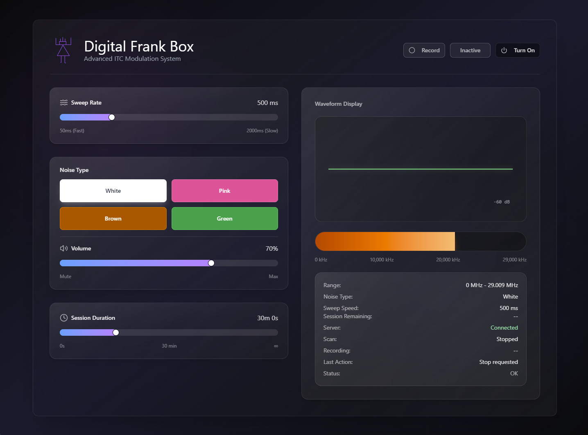

# 🧰 Digital Frank Box

**Digital Frank Box** is an advanced, software-based Instrumental Transcommunication (ITC) system designed specifically for **paranormal researchers**. Inspired by the original Frank’s Box concept, this application modernizes the methodology by leveraging **global WebSDR (Software Defined Radio)** sources, randomized frequency sweeping, and controlled noise environments.

Unlike traditional hardware-based SBS or spirit boxes, Digital Frank Box is **entirely digital**, platform-independent, and free from the limitations of local broadcast frequencies.

---

## 🖼️ Interface Preview

> *Screenshot shown below reflects the current research interface and waveform monitoring system.*

---

## 🔬 Research-Oriented Design Philosophy

Digital Frank Box was designed with the following research goals in mind:

* Eliminate predictable linear sweep artifacts
* Remove rhythmic audio gaps common in traditional spirit boxes
* Expand signal diversity through **global radio access**
* Allow controlled environmental noise masking
* Provide session repeatability and documentation via recording

The result is a system intended to reduce false auditory patterning while increasing signal complexity for analytical review.

---

## 📜 Historical Context: Frank’s Box

The original *Frank’s Box* was developed in the early 2000s by paranormal investigator **Frank Sumption** as a tool for Instrumental Transcommunication (ITC) research. The device was designed to rapidly scan AM or FM radio frequencies, briefly sampling fragments of live broadcast audio.

Investigators theorized that these short audio segments could be manipulated to form meaningful responses during paranormal communication sessions. This method became widely adopted in ghost hunting and EVP research and later evolved into what are commonly referred to as **SBS (Spirit Box Scanning) devices**.

### Limitations of Traditional Frank’s Boxes

While influential, traditional hardware-based Frank’s Boxes exhibit several known constraints:

* **Linear frequency sweeping**, creating predictable cadence
* **Local-only broadcast dependence**, limiting signal diversity
* **Audible rhythmic gaps** between station changes
* Susceptibility to **pattern recognition and auditory pareidolia**

### Digital Frank Box: A Modern Evolution

Digital Frank Box was created to preserve the *conceptual intent* of Frank Sumption’s original design while addressing its technical limitations through modern software techniques:

* Replaces local hardware radios with **global WebSDR sources**
* Uses **randomized, non-linear frequency selection**
* Introduces controlled **noise floor modulation** to eliminate segmented silence
* Enables repeatable, recordable sessions for analytical review

This approach positions Digital Frank Box not as a replacement for historical methodology, but as a **research-focused evolution** of the original Frank’s Box concept.

---

## ✨ Core Features

### 🌍 Global WebSDR Signal Sources

* Accesses **hundreds of predefined radio frequencies worldwide**
* Not limited to local AM/FM broadcast ranges
* Requires an active internet connection

### 🔀 Randomized Frequency Sweeping

* Frequencies are selected **non-linearly and randomly**
* Avoids cadence and predictability present in linear sweep devices

### 🎚️ Sweep Rate Control

* Adjustable sweep timing (milliseconds)
* Fine control for fast or slow scanning methodologies

### 🎧 Noise Floor Modulation

Selectable background noise profiles:

* White Noise
* Pink Noise
* Brown Noise
* Green Noise

Noise can be enabled or disabled depending on research protocol. When enabled, it removes segmented silence between frequency changes.

### 🔊 Volume Control

* Independent output level control
* Suitable for headphones, speakers, or echo box routing

### ⏱️ Session Management

* Configurable session duration
* Real-time session status monitoring

### 🎙️ Session Recording

* Record full sessions for later review
* Supports evidence cataloging and analysis workflows

### 🔁 Echo Box Compatibility

* When paired with an external echo box, Digital Frank Box functions as a **fully digital Frank’s Box system**

---

## 🖥️ Supported Platforms

Digital Frank Box is a **desktop application** available for:

* 🪟 Windows
* 🍎 macOS
* 🐧 Linux

> All platforms require an active internet connection for WebSDR access.

---

## 📥 Downloads

> Replace these links with your actual release URLs.

* **Windows**: [windows releases](https://drive.google.com/file/d/1jEMcY_u8DtjuQg2EBqcq_nyrLElR99au/view?usp=drive_link)
* **macOS**: [mac releases](https://drive.google.com/file/d/1p73uA03cEspYBzNubf1JW4SD0uQp7SVR/view?usp=drive_link)
* **Linux**: [linux releases](https://github.com/yourusername/digital-frank-box/releases/linux)

---

## 🧪 Recommended Research Use

* Use **high-quality headphones** or a controlled speaker setup
* Pair with an **echo box** if following traditional Frank’s Box methodology
* Enable noise modulation to reduce station-to-station artifacts
* Record all sessions for peer review and comparative analysis

---

## ⚠️ Disclaimer

This software is intended for **experimental, research, and investigative use only**.

No claims are made regarding the source, intelligence, or nature of any perceived audio phenomena.

---

## 📄 License

**Copyright © 2026 DaedNoise**
All rights reserved.
